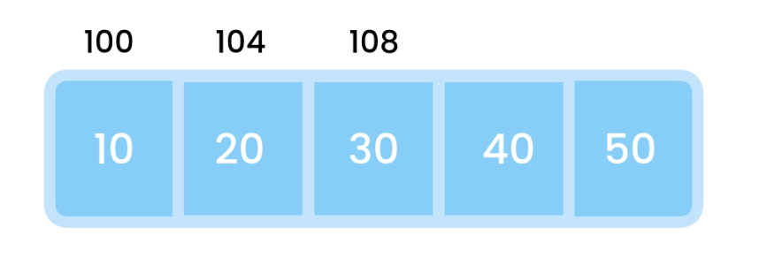

# 🧮 Data Structures and Algorithms

> Being a good programmer is not about learning new languages, it is about solving complex problems in efficient way.

## Data Structure

Data structure is a way of organizing the data, so that it can be used **efficiently**.

### Usage

Different types of data structures are suited to different kinds of applications, and some are highly specialized to specific tasks. For example, relational databases commonly use B-tree indexes for data retrieval, while compiler implementations usually use hash tables to look up identifiers

### Categories

Data structures are divided into two categories:

- Linear data structure
- Non-linear data structure

### Linear Data Structure

Data elements are arranged in a linear order.

Examples are: array, stack, queue, linked-list etc.

Applications of linear data structures are mainly in application software development.

In a linear data structure, memory is not utilized in an efficient way.

### Non-linear Data Structure

Data elements are attached in hierarchically manner.

Examples are: trees and graphs.

Applications of non-linear data structures are in artificial intelligence and image processing.

In non-linear data structure, memory is utilized in an efficient way.

## Algorithm

An algorithm is a set of instructions for solving a problem or accomplishing a task.

### Algorithm Efficiency

Algorithm efficiency relates to the amount of computational resources used by the algorithm.

For maximum efficiency we wish to minimize resource usage.

### Algorithm Complexity

The complexity of an algorithm describes the efficiency of the algorithm in terms of the input size.

Two main complexity measures of an algorithm:

- Time complexity
- Space complexity

### Time complexity

Time complexity is a function describing the amount of time an algorithm takes in terms of the amount of input to the algorithm.

### Space complexity

Space complexity a function describing the amount of memory (space) an algorithm takes in terms of the amount of input to the algorithm.

## Asymptotic Notation

These are the mathematical notations that are used for the asymptotic analysis of the algorithms. The most common notation used is "big O" notation.

### Big O Notation

It measures how quickly the run-time grows relative to the input of an algorithm. Another way to say, it is used for calculating the worst-case complexity of an algorithm.

Source: [Big O Cheat Sheet](http://bigocheatsheet.com/)

Below is the list of some of the most used Big O notations and their performance comparisons against different sizes of the input data.

| Big O Notation | Name         | Computations for 10 elements | Computations for 100 elements | Computations for 1000 elements |
| -------------- | ------------ | ---------------------------- | ----------------------------- | ------------------------------ |
| **O(1)**       | Constant     | 1                            | 1                             | 1                              |
| **O(log N)**   | Logarithmic  | 3                            | 6                             | 9                              |
| **O(N)**       | Linear       | 10                           | 100                           | 1000                           |
| **O(N log N)** | Linearithmic | 30                           | 600                           | 9000                           |
| **O(N^2)**     | Quadratic    | 100                          | 10000                         | 1000000                        |
| **O(2^N)**     | Exponential  | 1024                         | 1.26e+29                      | 1.07e+301                      |
| **O(N!)**      | Factorial    | 3628800                      | 9.3e+157                      | 4.02e+2567                     |

Source: [javascript-algorithms](https://github.com/trekhleb/javascript-algorithms#big-o-notation)

#### Resource Links

- [📃 Ace Your Coding Interview by Understanding Big O Notation — and Write Faster Code](https://medium.com/@bretcameron/ace-your-coding-interview-by-understanding-big-o-notation-and-write-faster-code-6b60bd498040)
- [🎞️ Big O Notation - Full Course](https://www.youtube.com/watch?v=Mo4vesaut8g)
- [📃 Big O Practice](https://www.learnhowtoprogram.com/computer-science/big-o-notation-and-binary-trees/big-o-practice)

## Arrays

- Array is the simplest data structure
- Array used to store list of items
- Array is the optimal data structure for accessing data by their index
- In many languages like (C#, Java) arrays are static

### Complexity

| Operation       | Big O |
| --------------- | ----- |
| Lookup by Index | O(1)  |
| Lookup by Value | O(n)  |
| Insert          | O(n)  |
| Delete          | O(n)  |
